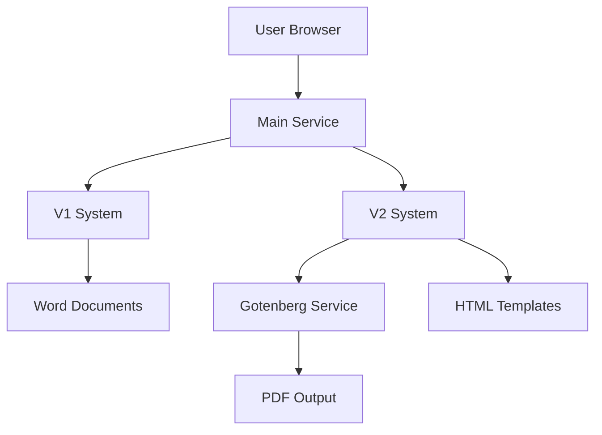

# Ghost Gym V2 - Deployment Architecture & Update Guide

## 🏗️ Current Deployment Status

**✅ FULLY OPERATIONAL** - All services are deployed and working correctly.

### Live URLs
- **Main Application**: https://simplegym-v2-production.up.railway.app
- **V1 Interface**: https://simplegym-v2-production.up.railway.app/
- **V2 Interface**: https://simplegym-v2-production.up.railway.app/v2
- **Gotenberg Service**: https://gotenberg-production-c928.up.railway.app
- **API Documentation**: https://simplegym-v2-production.up.railway.app/docs

## 🏛️ Architecture Overview

```
┌─────────────────────────────────────────────────────────────┐
│                    Railway Project: simplegym-v2            │
├─────────────────────────────────────────────────────────────┤
│                                                             │
│  ┌─────────────────────┐    ┌─────────────────────────────┐ │
│  │   Main Service      │    │    Gotenberg Service        │ │
│  │   simplegym-v2      │◄──►│    gotenberg                │ │
│  │                     │    │                             │ │
│  │ • FastAPI Backend   │    │ • HTML to PDF conversion   │ │
│  │ • V1 & V2 Frontend  │    │ • Docker: gotenberg/        │ │
│  │ • Static Files      │    │   gotenberg:8               │ │
│  │ • API Endpoints     │    │ • Port: 3000                │ │
│  └─────────────────────┘    └─────────────────────────────┘ │
│                                                             │
└─────────────────────────────────────────────────────────────┘
```

## 📦 Service Details

### 1. Main Service (`simplegym-v2`)
- **Repository**: https://github.com/tbattista/simplegym-2025.git
- **Branch**: `v2-development`
- **Dockerfile**: `Dockerfile.python`
- **Port**: 8080 (Railway managed)
- **Domain**: https://simplegym-v2-production.up.railway.app

#### Features:
- **V1 System**: Word document generation using `python-docx`
- **V2 System**: HTML template rendering + PDF generation via Gotenberg
- **Static File Serving**: Frontend assets (HTML, CSS, JS)
- **API Endpoints**: RESTful API for both V1 and V2

#### Environment Variables:
```bash
GOTENBERG_URL=https://gotenberg-production-c928.up.railway.app
ENVIRONMENT=production
RAILWAY_SERVICE_GOTENBERG_URL=gotenberg-production-c928.up.railway.app
```

### 2. Gotenberg Service (`gotenberg`)
- **Docker Image**: `gotenberg/gotenberg:8`
- **Port**: 3000 (Railway managed)
- **Domain**: https://gotenberg-production-c928.up.railway.app
- **Health Check**: `/health`

#### Purpose:
- Converts HTML documents to PDF
- Used exclusively by V2 system
- Provides professional PDF generation with proper formatting

## 🚀 Deployment Process

### Prerequisites
- Railway CLI installed and authenticated
- Git repository access
- Node.js/Python development environment (for local testing)

### Step-by-Step Deployment

#### 1. Code Changes
```bash
# Make your changes to the codebase
git add .
git commit -m "Your descriptive commit message"
git push origin v2-development
```

#### 2. Deploy Main Service
```bash
# Ensure you're in the project root
cd /path/to/simplegym_2025

# Link to the main service
railway service simplegym-v2

# Deploy the changes
railway up
```

#### 3. Deploy Gotenberg Service (if needed)
```bash
# Switch to gotenberg service
railway service gotenberg

# Redeploy if needed
railway redeploy
```

### 🔄 Update Workflows

#### For Frontend Changes (HTML/CSS/JS)
```bash
# 1. Make changes to files in frontend/ directory
# 2. Test locally if possible
# 3. Commit and push
git add frontend/
git commit -m "Update frontend: [description]"
git push origin v2-development

# 4. Deploy
railway service simplegym-v2
railway up
```

#### For Backend Changes (Python/API)
```bash
# 1. Make changes to files in backend/ directory
# 2. Test locally with: python run.py
# 3. Commit and push
git add backend/
git commit -m "Update backend: [description]"
git push origin v2-development

# 4. Deploy
railway service simplegym-v2
railway up
```

#### For Configuration Changes
```bash
# 1. Update railway.toml or requirements.txt
# 2. Commit and push
git add railway.toml requirements.txt
git commit -m "Update configuration: [description]"
git push origin v2-development

# 3. Deploy (Railway will detect config changes)
railway service simplegym-v2
railway up
```

## 🔧 Key Configuration Files

### `railway.toml` (Main Service)
```toml
[build]
builder = "dockerfile"
dockerfilePath = "Dockerfile.python"

[deploy]
restartPolicyType = "on_failure"
restartPolicyMaxRetries = 3

[[deploy.environmentVariables]]
name = "GOTENBERG_URL"
value = "https://gotenberg-production-c928.up.railway.app"

[[deploy.environmentVariables]]
name = "ENVIRONMENT"
value = "production"
```

### `gotenberg-service/railway.toml` (Gotenberg Service)
```toml
[build]
builder = "dockerfile"
dockerfilePath = "Dockerfile"

[deploy]
healthcheckPath = "/health"
healthcheckTimeout = 300
restartPolicyType = "on_failure"
restartPolicyMaxRetries = 10

[[deploy.environmentVariables]]
name = "PORT"
value = "3000"
```

## 🧪 Testing Deployment

### Health Checks
```bash
# Test main service
curl https://simplegym-v2-production.up.railway.app/api/health

# Test V2 status (includes Gotenberg connectivity)
curl https://simplegym-v2-production.up.railway.app/api/v2/status

# Test Gotenberg service directly
curl https://gotenberg-production-c928.up.railway.app/health
```

### Expected Responses
```json
// /api/health
{"status": "healthy", "message": "Gym Log API is running"}

// /api/v2/status
{
  "version": "v2",
  "status": "available", 
  "gotenberg_available": true,
  "features": {
    "html_templates": true,
    "pdf_generation": true,
    "instant_preview": true
  }
}
```

## 🐛 Troubleshooting

### Common Issues

#### 1. Gotenberg Connection Failed
**Symptoms**: `gotenberg_available: false` in V2 status
**Solutions**:
```bash
# Check Gotenberg service status
railway service gotenberg
railway logs

# Verify environment variables
railway service simplegym-v2
railway variables

# Redeploy if needed
railway service gotenberg
railway redeploy
```

#### 2. Frontend Assets Not Loading
**Symptoms**: 404 errors for CSS/JS files
**Solutions**:
```bash
# Check static file mounting in main.py
# Ensure files exist in frontend/ directory
# Redeploy main service
railway service simplegym-v2
railway up
```

#### 3. API Endpoints Not Working
**Symptoms**: 404/500 errors on API calls
**Solutions**:
```bash
# Check logs for errors
railway service simplegym-v2
railway logs

# Verify route registration in main.py
# Check for Python import errors
```

### Monitoring Commands
```bash
# View real-time logs
railway logs

# Check service status
railway status

# View environment variables
railway variables

# List all services
railway service
```

## 📊 Service Dependencies



## 🔐 Security Considerations

- **CORS**: Configured to allow all origins (consider restricting in production)
- **Environment Variables**: Sensitive data stored in Railway environment
- **HTTPS**: All services use HTTPS by default via Railway
- **Service Communication**: Internal Railway networking for service-to-service calls

## 📈 Performance Notes

- **Cold Starts**: Services may have ~2-3 second cold start time
- **PDF Generation**: Gotenberg adds ~1-2 seconds for PDF conversion
- **Static Files**: Served directly by FastAPI (consider CDN for high traffic)
- **Database**: Currently file-based (consider database for user data)

## 🔄 Rollback Procedure

If a deployment fails:
```bash
# 1. Check the previous working commit
git log --oneline

# 2. Revert to previous commit
git revert <commit-hash>

# 3. Push the revert
git push origin v2-development

# 4. Redeploy
railway service simplegym-v2
railway up
```

## 📝 Maintenance Tasks

### Regular Maintenance
- **Weekly**: Check service logs for errors
- **Monthly**: Review and clean up old generated files
- **Quarterly**: Update dependencies in requirements.txt

### Scaling Considerations
- **Traffic Growth**: Railway auto-scales within limits
- **File Storage**: Consider external storage for generated files
- **Database**: Implement proper database for user sessions/data

---

## 🎯 Quick Reference

### Essential Commands
```bash
# Deploy main service
railway service simplegym-v2 && railway up

# Check status
railway service simplegym-v2 && railway status

# View logs
railway service simplegym-v2 && railway logs

# Check Gotenberg
railway service gotenberg && railway status
```

### Key URLs for Testing
- Main App: https://simplegym-v2-production.up.railway.app
- V2 Interface: https://simplegym-v2-production.up.railway.app/v2
- API Docs: https://simplegym-v2-production.up.railway.app/docs
- Health Check: https://simplegym-v2-production.up.railway.app/api/health
- V2 Status: https://simplegym-v2-production.up.railway.app/api/v2/status

---

**Last Updated**: August 9, 2025  
**Status**: ✅ All systems operational  
**Next Review**: September 9, 2025
